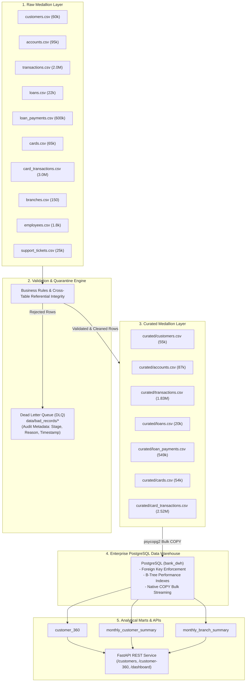

# LedgerFlow — Enterprise Banking Data Warehouse & Modern Data Platform

**LedgerFlow** is an end-to-end, production-grade Banking Data Engineering platform built in Python, PostgreSQL, and FastAPI. It ingests 10 core banking datasets (~5.8M rows), enforces strict schema validations and cross-table referential integrity, quarantines bad records into an audited Dead Letter Queue (DLQ), loads 5.12M+ curated records into a PostgreSQL Data Warehouse via native bulk COPY streaming, materializes Customer 360 analytics marts, and serves REST APIs.

---

## ⚡ One-Command Run

You can run the entire platform — from running all 41 test cases to orchestrating the complete 10-dataset pipeline and database load — with a single command:

### Option A: Local CLI One-Command Run (Recommended)
```bash
./run_all.sh
```
*Or using Make:*
```bash
make run
```
> **What this executes automatically:**
> 1. Runs the **41 Pytest validator tests** (verifying 100% data quality & integrity pass).
> 2. Executes the **10-dataset Medallion Pipeline** in dependency order (~5.8M raw rows -> 5.12M curated rows + audited DLQ).
> 3. Connects to PostgreSQL, performs bulk `COPY` streaming, and refreshes Customer 360 & analytical marts (if DB is running).
> 4. Prints a full audit report with execution times and records breakdown.

### Option B: Fully Dockerized One-Command Run
```bash
docker-compose up --build -d
```
Spins up PostgreSQL 15 and the FastAPI REST service in isolated containers with auto-initialized schemas and health checks.

---

## 1. System Architecture



---

## 2. Key Engineering Highlights

* **Medallion Architecture**: Strict isolation of Raw, Quarantine (DLQ), and Curated layers.
* **Pre-Load Referential Integrity**: Verifies foreign keys in-memory before loading into PostgreSQL (e.g., rejecting transactions for accounts whose customer failed credit score rules).
* **Chunked High-Throughput Streaming**: Streams multi-million row files (2M transactions, 3M card transactions) in 200k–300k record batches, maintaining a flat memory footprint and executing the entire 5.8M+ record pipeline in ~35 seconds.
* **Audited Dead Letter Queue (DLQ)**: Zero data loss. Every rejected record is stamped with forensic audit fields:
  * `rejection_reason` (e.g., `Customer ID 8888 not found in Curated Customers`)
  * `validation_stage` (`Primary Key Constraint`, `Referential Integrity`, `Domain Boundary Check`, `Format Validation`, `Accounting Reconciliation`)
  * `pipeline_name`
  * `processed_at`
* **Automated Master Orchestration**: Executes all 10 pipelines in strict topological dependency order (Branches -> Employees -> Customers -> Accounts -> Transactions / Loans / Cards -> Payments / Support).
* **Dimensional Modeling & Analytical Marts**: Fully indexed relational schema with materializations for `customer_360`, monthly customer summaries, and branch profitability.
* **Sub-10ms REST API**: FastAPI backend providing instant sub-10ms queries over 5+ million warehouse records with Swagger docs.

---

## 3. Data Pipeline Metrics

| Dataset / Entity | Raw Records Ingested | Curated (Good) | Quarantined (DLQ) | Success Rate | Ingestion Method |
| :--- | :--- | :--- | :--- | :--- | :--- |
| **`branches`** | 150 | 150 | 0 | 100.0% | Pandas In-Memory |
| **`employees`** | 1,800 | 1,800 | 0 | 100.0% | Referential In-Memory |
| **`customers`** | 60,000 | 55,050 | 4,950 | 91.75% | Pandas In-Memory |
| **`accounts`** | 95,000 | 87,177 | 7,823 | 91.77% | Referential In-Memory |
| **`transactions`** | 2,000,000 | 1,835,551 | 164,449 | 91.78% | 250k Stream Chunks |
| **`loans`** | 22,000 | 20,137 | 1,863 | 91.53% | Referential In-Memory |
| **`loan_payments`** | 600,000 | 549,015 | 50,985 | 91.50% | 200k Stream Chunks |
| **`cards`** | 65,000 | 54,643 | 10,357 | 84.07% | Dual Referential Check |
| **`card_transactions`**| 3,000,000 | 2,521,980 | 478,020 | 84.07% | 300k Stream Chunks |
| **`support_tickets`** | 25,000 | 22,927 | 2,073 | 91.71% | Referential In-Memory |
| **TOTAL** | **5,868,950** | **5,148,430** | **720,520** | **87.72%** | **~35s End-to-End** |

---

## 4. Test Suite (41 Pytest Validator Tests)

The test suite in [`tests/test_validation.py`](tests/test_validation.py) contains **41 automated unit tests** verifying data quality rules, edge cases, boundaries, and referential constraints across all 10 banking entities:

| Category / Entity | Tests | Scenarios Covered |
| :--- | :---: | :--- |
| **Customers** | 4 | Valid customer schemas; email regex formats; credit score boundaries (min 300, max 850); non-positive income; duplicate customer IDs; null/blank customer IDs. |
| **Branches** | 4 | Valid branch schemas; missing IFSC code; blank branch names; missing city/state; duplicate branch IDs; date parsing. |
| **Accounts** | 4 | Valid account types (Savings, Current, Salary, FD, NRI); case insensitivity; initial zero balance; negative balance; orphan customer FK; duplicate account IDs; unapproved statuses. |
| **Employees** | 4 | Valid roles; case-insensitive role matching; non-positive salary; orphan branch FK; invalid hire date; duplicate employee IDs. |
| **Transactions** | 4 | Strictly positive amount (> 0); zero amount; channel case-insensitivity (ATM, UPI, Mobile App); invalid transaction types; unparseable dates; duplicate transaction IDs; orphan account FK. |
| **Loans** | 4 | Valid loans; interest rate boundaries (1.0% to 50.0%); zero/negative interest rate; zero/negative term months; unapproved loan statuses; orphan customer FK; duplicate loan IDs. |
| **Loan Payments** | 4 | Valid payments; 5-cent accounting reconciliation tolerance (`abs(principal + interest - amount) <= 0.05`); mismatched components; negative principal/interest; non-binary late payment flag; orphan loan FK; duplicate payment IDs. |
| **Cards** | 4 | Dual foreign key referential integrity (`customer_id` AND `account_id`); same-day expiry boundary (`expiry_date >= issue_date`); expiry before issue date; negative credit limit; zero limit (debit cards); duplicate card IDs. |
| **Card Transactions** | 4 | Valid card transactions; empty/whitespace merchant category; non-positive amount; binary fraud flag validation (`is_fraud` in [0, 1]); orphan card FK; duplicate transaction IDs. |
| **Support Tickets** | 4 | Valid tickets; open ticket null resolution date (`date_resolved = NaN`); same-day resolution; resolution before opened chronology error; satisfaction score boundaries (1 to 5); missing issue type; duplicate ticket IDs. |

### Run Tests:
```bash
pytest -v
```
*(Or via Make: `make test`)*

---

## 5. Project Structure

```text
ledgerflow/
├── run_all.sh                         # Master One-Command execution script
├── Makefile                           # Unified CLI shortcuts (run, test, etl, api, docker)
├── pytest.ini                         # Pytest configuration & pythonpath
├── requirements.txt                   # Complete project dependencies
├── Dockerfile                         # Container image definition
├── docker-compose.yml                 # PostgreSQL 15 + FastAPI container stack
├── dags/
│   └── banking_pipeline_dag.py        # Apache Airflow scheduled DAG definition
├── data/
│   ├── raw/                           # Raw bank CSV exports (~5.8M rows)
│   ├── curated/                       # Validated, cleansed files (~5.1M rows)
│   └── bad_records/                   # Quarantined DLQ with audit columns
├── scripts/
│   ├── run_pipeline.py                # Master DAG Orchestrator (10 pipelines)
│   ├── process_customers.py           # Customer ETL
│   ├── process_accounts.py            # Accounts ETL
│   ├── process_transactions.py        # Transactions ETL (Chunked streaming)
│   ├── process_loans.py               # Loans ETL
│   ├── process_loan_payments.py       # Loan Payments ETL (Reconciliation)
│   ├── process_cards.py               # Cards ETL (Dual FK check)
│   ├── process_card_transactions.py   # Card Txns ETL (Chunked streaming)
│   ├── process_branches.py            # Branches ETL
│   ├── process_employees.py           # Employees ETL
│   ├── process_support_tickets.py     # Support Tickets ETL
│   ├── load_postgres.py               # Native COPY Bulk Loader
│   └── api.py                         # FastAPI REST Endpoints & KPIs
├── validation/                        # 10 dedicated Data Quality validator modules
├── transformation/                    # 10 dedicated cleansing and normalization modules
├── sql/
│   ├── schema/create_tables.sql       # Relational DDL with FKs & Indexes
│   ├── analytics/create_analytics_tables.sql # Customer 360 & Summary Marts
│   └── queries/analytics_queries.sql  # 25 Financial & Business KPI queries
├── tests/
│   └── test_validation.py             # 41 Pytest unit tests for all validators
├── docs/
│   └── data_dictionary.md             # Full Enterprise Data Dictionary
└── logs/                              # Pipeline execution logs and audit reports
```

---

## 6. Step-by-Step Manual Execution (Alternative)

If you prefer executing each stage step-by-step:

### Step 1: Install Dependencies
```bash
pip install -r requirements.txt
```

### Step 2: Run Unit Tests
```bash
pytest -v
```

### Step 3: Run the 10-Dataset Pipeline
```bash
python3 scripts/run_pipeline.py
```

### Step 4: Initialize PostgreSQL Warehouse & Bulk Load
```bash
# 1. Apply DDL schema with primary and foreign keys
psql -U postgres -d bank_dwh -f sql/schema/create_tables.sql

# 2. Bulk load 5.12M curated records via high-speed COPY
python3 scripts/load_postgres.py

# 3. Materialize analytical marts & Customer 360 view
psql -U postgres -d bank_dwh -f sql/analytics/create_analytics_tables.sql
```

### Step 5: Launch FastAPI REST Service
```bash
uvicorn scripts.api:app --host 0.0.0.0 --port 8000 --reload
```
Interactive Swagger API documentation available at **[http://localhost:8000/docs](http://localhost:8000/docs)**.

---

## 7. Sample API Responses

### `GET /dashboard`
Executive KPI summary aggregated across all 10 entities:
```json
{
  "kpis": {
    "total_customers": 55050,
    "total_accounts": 87177,
    "total_deposits": 3988526118.95,
    "total_active_loans": 13098,
    "active_loan_portfolio": 5462884935.72,
    "active_cards": 48143,
    "lifetime_transactions": 1835551,
    "lifetime_card_transactions": 2521980,
    "total_fraud_transactions": 12634
  },
  "customer_segments": [
    { "customer_segment": "Premium / Low Risk", "count": 5058 },
    { "customer_segment": "Standard / Moderate Risk", "count": 15121 },
    { "customer_segment": "Subprime / High Risk", "count": 34871 }
  ]
}
```

### `GET /customer/101`
Unified **Customer 360** profile containing linked accounts, loans, credit/debit cards, and monthly financial metrics:
```json
{
  "customer": {
    "customer_id": 101,
    "name": "Jane Doe",
    "email": "jane.doe@example.com",
    "credit_score": 720,
    "annual_income": 85000.0,
    "customer_segment": "Premium / Low Risk"
  },
  "accounts": [
    { "account_id": 1001, "account_type": "Savings", "balance": 1500.50, "status": "Active" }
  ],
  "loans": [
    { "loan_id": 201, "loan_amount": 250000.0, "interest_rate": 6.5, "status": "Active" }
  ],
  "cards": [
    { "card_id": 301, "card_type": "Credit - Platinum", "credit_limit": 10000.0, "status": "Active" }
  ]
}
```

---

## 8. CLI Command Quick Reference

| Command | Action |
| :--- | :--- |
| **`./run_all.sh`** | **One-command full run**: executes tests, 10 ETL pipelines, and DB load. |
| **`./run_all.sh --test-only`** | Runs only the 41 Pytest validator test suite. |
| **`./run_all.sh --api`** | Runs full pipeline and immediately spins up FastAPI server. |
| **`make test`** | Runs Pytest with verbose test descriptions. |
| **`make etl`** | Runs the 10-dataset master ETL pipeline. |
| **`make load`** | Loads curated CSVs into PostgreSQL via COPY streaming. |
| **`docker-compose up --build -d`** | Starts containerized PostgreSQL warehouse and FastAPI. |
